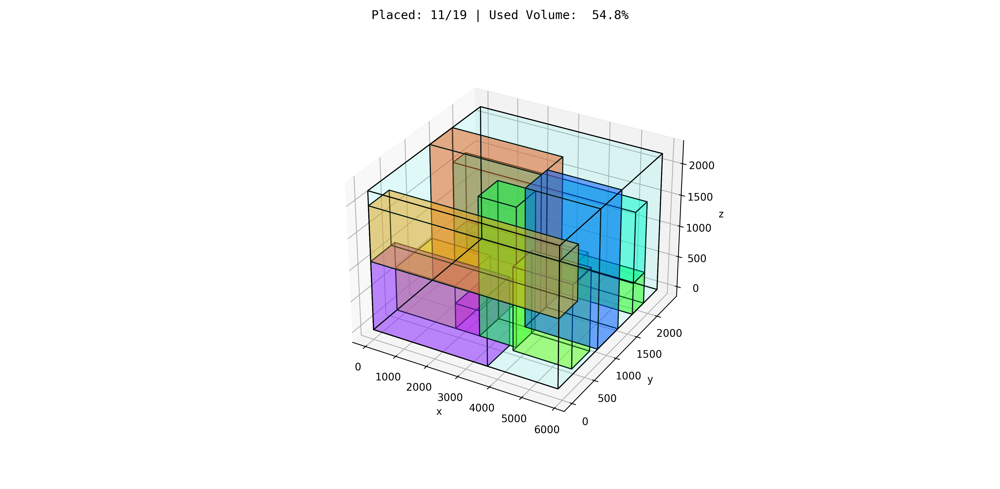

# Attempting Jumanji's Bin packing environemnt

 

Policy 
--------------------------
- Currently I have implemented **DQN** with no repesentation model so states are just flatten 1D vectors.
- the matters of the heart haven distracted me. I will be back soon with a broken heart, more coffee and a better policy architecture, something with 'planning policy' 
 
How to use
--------------------------
- All the code is in **main.py**
- To train a model, run the main function: ``python main.py``.

Results
--------------------------
**COMING SOON**

Credits Similar work
--------------------------
- https://github.com/luisgarciar/3D-bin-packing
  - Maskable PPO
  - **Paper by InstaDeep** https://arxiv.org/pdf/1807.01672.pdf

- https://github.com/AltynayShubekova/BDRP-intermediate
  - DQN on jumanji
- https://github.com/LeonardoClemente/binPackingPolicyGradients
  -hyper-heuristic selection model
- https://github.com/alexfrom0815/Online-3D-BPP-DRL
  - environment **states** seem like a **2D image** of the the containers faces
- https://github.com/verystrongjoe/bin-packing-env
  - Branch-DQN Agent
  - **2D environment**
- https://github.com/shiveshkhaitan/ranked_reward_rl
  - 2D Problem
  - PPO
- https://github.com/djkim9031/BinPacker_RL
  - PPO or SAC

